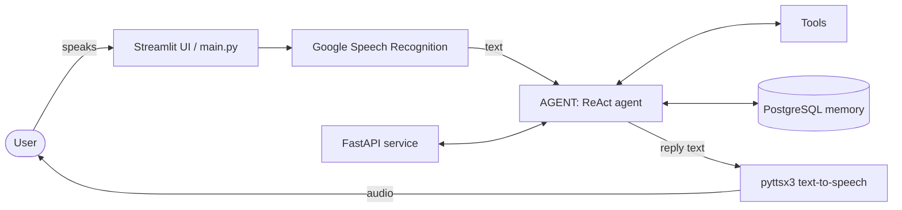

# Jarvis Voice Agent

A voice-first AI assistant that listens, thinks and answers out loud. Speak a request, and Jarvis transcribes it, reasons about it with a ReAct-style agent, uses tools when needed (web search, system and app control, Python execution, to-do list, long-term memory), and replies in a spoken voice.

---

## 📷 Screenshots


---

## Features

- **Voice input.** Record your question in the browser (or in the terminal) and Jarvis transcribes it with Google Speech Recognition.
- **ReAct agent.** Built with LangChain and LangGraph, the agent reasons step by step and decides which tool to call to complete your request.
- **Tool use.** Web search, application control, system actions, a Python REPL, a to-do manager and a memory tool.
- **Permanent memory.** Replies stay consistent per `user_id` and `thread_id`, and everything Jarvis learns is stored in a PostgreSQL database, so it is still remembered after restarts.
- **Voice replies.** Every answer can be spoken back using text-to-speech, with adjustable speed.
- **Two ways to talk.** Use the Streamlit web interface or the terminal voice loop in `main.py`.
- **REST API.** A FastAPI service exposes the agent so other apps can talk to it.
- **Text fallback.** Type a message if you cannot or do not want to speak.
- **Polished UI.** Jarvis-style dark blue theme, animated state orb, chat bubbles, session counters and a settings sidebar.

---

## How it works



1. The user speaks into the microphone.
2. The audio is converted to text with Google Speech Recognition.
3. The text is sent to `run_agent(...)` together with a `user_id` and a `thread_id`.
4. The agent reasons, calls tools if needed, and reads or writes memory.
5. The final reply is shown in the chat and spoken aloud with `pyttsx3`.

---

## Tools

| Tool file | What it is for |
|---|---|
| `tools/tavily_tool.py` | Web search through the Tavily API for up-to-date information |
| `tools/memory_tool.py` | Saves and recalls information in PostgreSQL so Jarvis remembers you permanently |
| `tools/todo_tool.py` | Adds, lists and manages to-do items |
| `tools/app_tool.py` | Opens and controls applications on the computer |
| `tools/system_tool.py` | Performs system-level actions and queries |
| `tools/REPL_tool.py` | Runs Python code for calculations and quick scripts |

---

## Technology stack

| Area | Technology | Purpose |
|---|---|---|
| Language | Python | Core language of the whole project |
| Web UI | Streamlit | Interactive voice interface with custom HTML and CSS |
| API | FastAPI | HTTP service that exposes the agent |
| Agent framework | LangChain | Tool definitions, model integration and agent building blocks |
| Agent orchestration | LangGraph | Stateful ReAct agent graph with thread-based memory |
| Agent | ReAct agent (`AGENT/agent.py`) | Reasoning loop that chooses and calls tools |
| Speech to text | SpeechRecognition + Google Web Speech API | Converts spoken audio to text |
| Text to speech | pyttsx3 | Offline voice replies |
| Audio capture | sounddevice | Microphone recording in the terminal mode |
| Audio files | soundfile | Reading and writing WAV audio |
| Numerics | NumPy | Audio array handling |
| Database | PostgreSQL | Permanent memory and data storage that survives restarts |
| Web search | Tavily | Real-time search results for the agent |
| Configuration | `.env` file | API keys and secrets |

<!--
Add any extra libraries here, for example the LLM provider SDK, python-dotenv,
uvicorn, and the PostgreSQL driver (psycopg2 / psycopg / SQLAlchemy).
-->

---

## Project structure

```
JARVIS/
├── AGENT/
│   └── agent.py          # ReAct agent and run_agent()
├── FASTAPI/
│   └── api.py            # REST API for the agent
├── tools/
│   ├── app_tool.py       # Application control
│   ├── memory_tool.py    # Permanent memory (PostgreSQL)
│   ├── REPL_tool.py      # Python execution
│   ├── system_tool.py    # System actions
│   ├── tavily_tool.py    # Web search
│   └── todo_tool.py      # To-do manager
├── main.py               # Terminal voice loop
├── ui.py                 # Streamlit web interface
└── .env                  # API keys (never commit this file)
```

---

## Getting started

### 1. Clone the repository

```bash
git clone https://github.com/<your-username>/<your-repo>.git
cd <your-repo>
```

### 2. Create a virtual environment

```bash
python -m venv .venv
.venv\Scripts\activate        # Windows
source .venv/bin/activate     # macOS / Linux
```

### 3. Install dependencies

```bash
pip install -r requirements.txt
```

If you do not have a `requirements.txt` yet, create one from your working environment:

```bash
pip freeze > requirements.txt
```

### 4. Set up PostgreSQL

Install PostgreSQL, create a database for Jarvis, and make sure the server is running. Jarvis uses it as its permanent memory storage.

### 5. Configure environment variables

Create a `.env` file in the project root and add the API keys your agent and tools need (for example your language model key and your Tavily key) together with your PostgreSQL connection details. Never upload this file to GitHub.

### 6. Run Jarvis

**Streamlit web interface**

```bash
streamlit run ui.py
```

Then open `http://localhost:8501`, allow microphone access, tap the mic, speak, and tap again to stop.

**Terminal voice mode**

```bash
python main.py
```

**FastAPI service**

```bash
uvicorn FASTAPI.api:app --reload
```

---

## Usage tips

- Start Streamlit from the project root so the database and `.env` paths resolve the same way as in `main.py`.
- Keep the same **User ID** and **Conversation ID** in the sidebar to continue an earlier conversation.
- The browser microphone only works on `localhost` or over `https`.
- Text-to-speech runs on the machine that hosts the app. On Linux servers install `espeak` first.

---

## Security

- Keep `.env` out of version control by adding it to `.gitignore`.
- The Python REPL and system tools can run commands on your machine, so run Jarvis only in an environment you trust.

---

## Author

Built by **Hamza**.

If you like this project, give it a star on GitHub.
